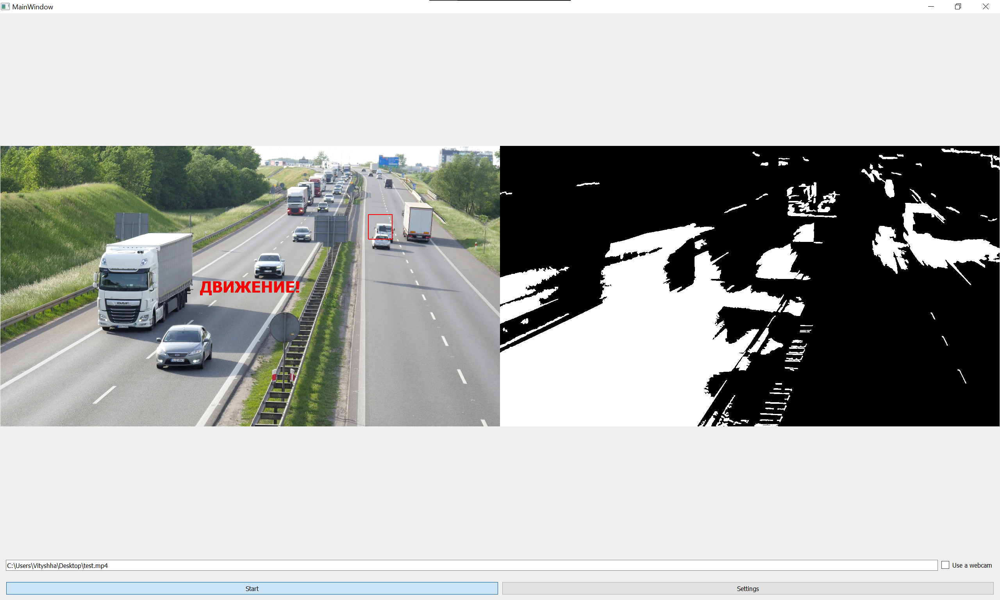
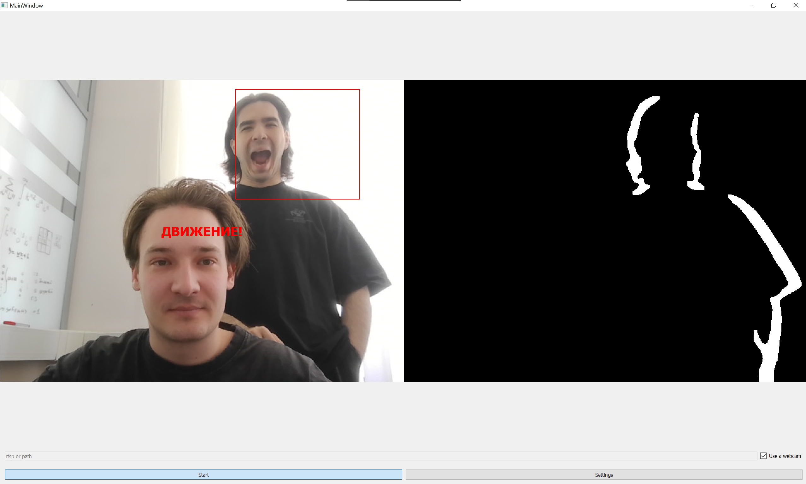

# motion-control

### Контроль движения в видеопотоке с помощью удаленного видео-анализа 


#### Функционал: 

```angular2html

```

#### Настраиваемые параметры:

```angular2html

```

### Примеры детекции движения




#### Если нужно изменить ui:

```angular2html
pyuic5 .\main.ui -o main.py
pyuic5 .\settings.ui -o settings.py
```

```angular2html
pyrcc5 res.qrc -o res_rc.py
```

```angular2html
import views.ui.res_rc
```