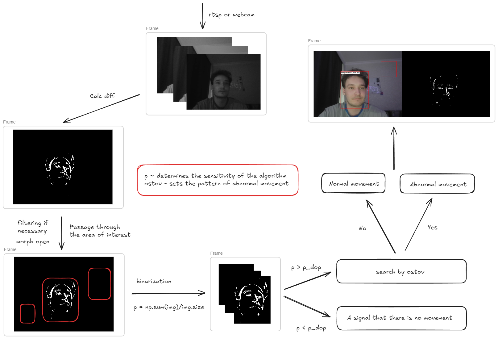

# motion-control

### Контроль движения в видеопотоке с помощью удаленного видео-анализа 


#### Функционал: 

```angular2html
1) Выделение зон интереса 
2) Детектирование движения и определение обычное движение или аномальное 
3) Визуализация результатов в реальном времени 
4) Настройка и сохранение параметров детектирование
```

#### Настраиваемые параметры:

```angular2html
1) ostov_size - размер паттерна для поиска (остова) 
2) p_dop - порог чувствительности (0-1) 
3) time_sleep - задержка между кадрами 
4) use_filter - морфологический фильтр 
5) is_webcam - определяет источник захвата ресурса 
```

### Структура 



### Примеры детекции движения


#### Если нужно изменить ui:

```angular2html
pyuic5 .\main.ui -o main.py
pyuic5 .\settings.ui -o settings.py
```

```angular2html
pyrcc5 res.qrc -o res_rc.py
```

```angular2html
import views.ui.res_rc
```